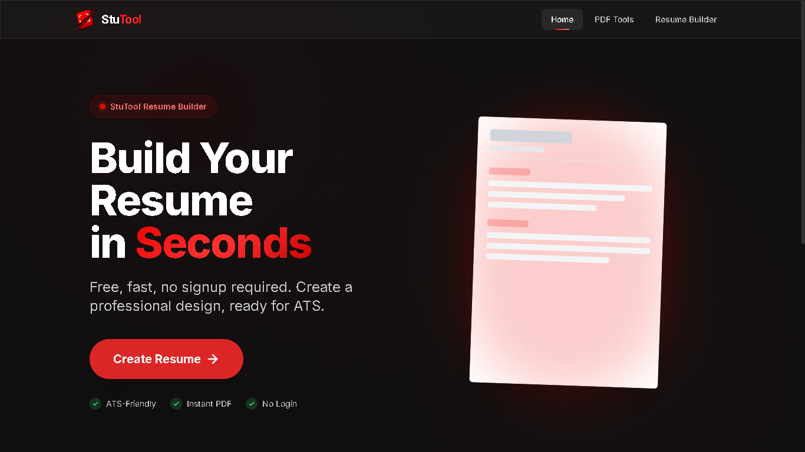

<div align="center">

# 🚀 StuTool

### All-in-One PDF & Resume Tool

Powerful online PDF tools and a professional Resume Builder — fast, simple, and privacy-focused.

🌐 **Live:** https://stutool.in

</div>

---

## ✨ Features

### 📄 PDF Tools

- 🖼️ Image to PDF
- 🔗 Merge PDF
- 📑 Multiple Pages Per Sheet
- ✂️ Extract PDF Pages
- 🗜️ Compress PDF

### 📄 Resume Builder

- ✨ **AI Career Objective Enhancer** (Powered by Gemini, Groq & OpenRouter)
- 📝 **Smart Formatting Engine** (Auto-capitalization & Title casing)
- 📄 **Fixed A4 Single-Page Layout Engine** (Consistent PDF export)
- 🎨 Professional & Modern resume templates
- ⚡ Instant PDF export

### ⚡ Designed For

- Students
- Professionals
- Teachers
- Job Seekers
- Everyday document tasks

---

## 🛠️ Tech Stack

- **Next.js**
- **React**
- **TypeScript**
- **Tailwind CSS**
- **Vercel**
- **Gemini / Groq / OpenRouter API** (AI Integration)

---

## 🌟 Why StuTool?

- ⚡ Fast & Responsive
- 🎨 Clean Modern UI
- 📱 Mobile Friendly
- 🔒 Privacy Focused
- 📄 No unnecessary complexity
- 💼 Student-first experience

---

## 📸 Screenshots

<h2 align="center">🌐 Web App Preview</h2>

<p align="center">
  
</p>

---

## 🚀 Getting Started

Clone the repository

```bash
git clone https://github.com/i-amsaif/StuTool.git
```

Install dependencies

```bash
npm install
```

Run the development server

```bash
npm run dev
```

Open

```
http://localhost:3000
```

---

## 📂 Project Structure

```
├── app/
├── components/
├── hooks/
├── lib/
├── public/
├── styles/
└── utils/
```

---

## 🌐 Live Website

👉 https://stutool.in

---

## 🤝 Contributing

Contributions, ideas and feature requests are welcome.

Feel free to fork the repository and submit a Pull Request.

---

## ⭐ Support

If you found this project useful, consider giving it a ⭐ on GitHub.

It helps the project reach more people.

---

<div align="center">

### Made with ❤️ by Mohammed Saif

</div>
